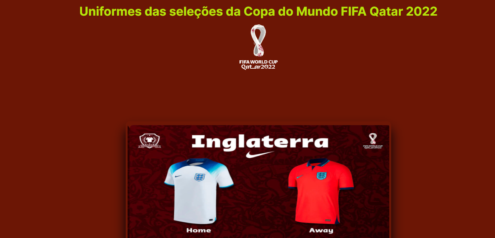
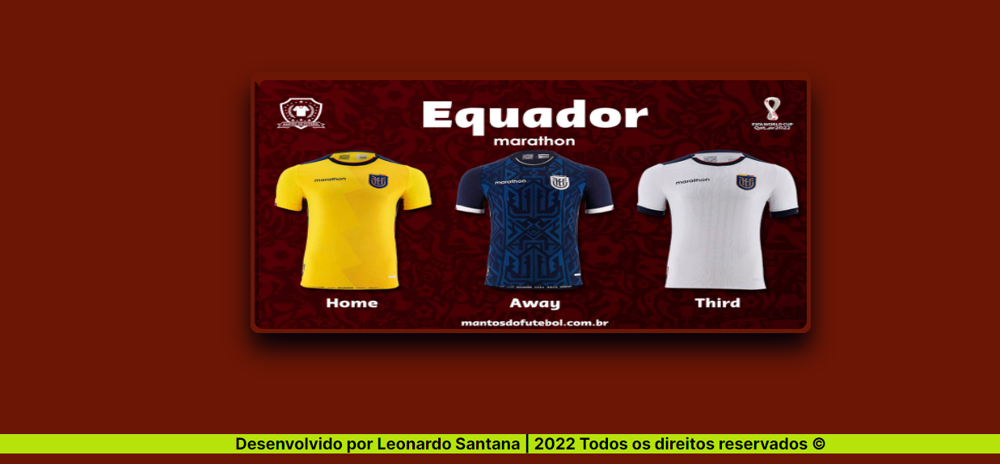
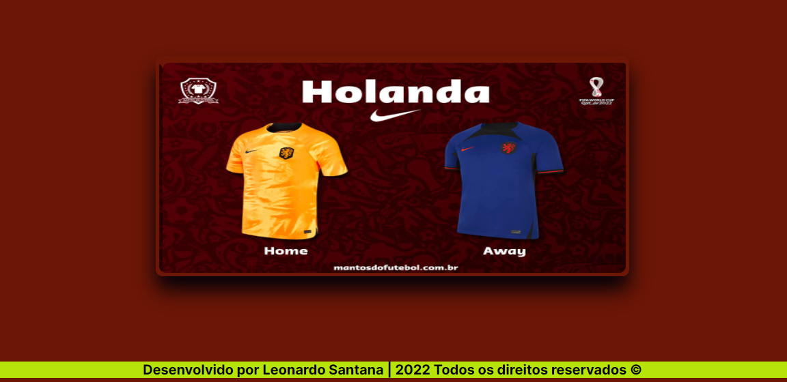
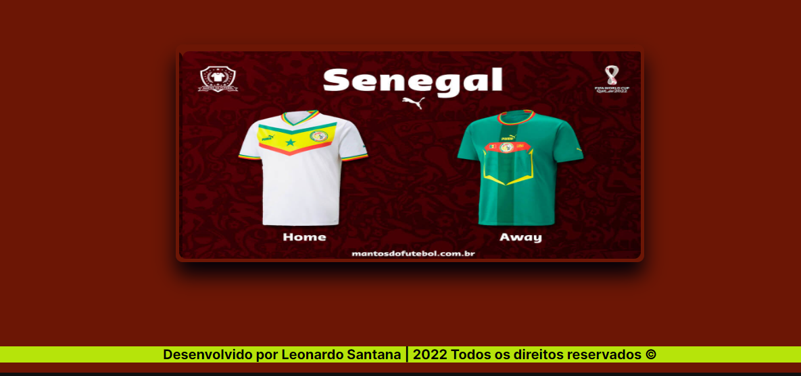

# Sobre o projeto:

Projeto de um Slider de imagens de todos os uniformes das 32 seleções da Copa do Mundo FIFA 2022,  desenvolvido em HTML5, CSS3 e JavaScript, onde o objetivo é mostrar os uniformes das 32 seleções da Copa. No projeto, na parte do CSS, foi aprendido a usar variáveis para usar no slider, foi aprendido também usar o flexbox para posicionar os elementos. No JavaScript, o uso de funções anõnimas foi usado para pegar as imagens do slider, junto com a DOM. O evento de click foi usado, para que o usuário consiga passar as imagens no slider.

# Tecnologias utilizadas:

- HTML5,
- CSS3 e 
- JavaScript;

# Layout do projeto:

# Link do projeto:

# Autor:

Onde me encontar?

-Entrar em contato comigo:

https://lsantana95.github.io/RocketLinks/
